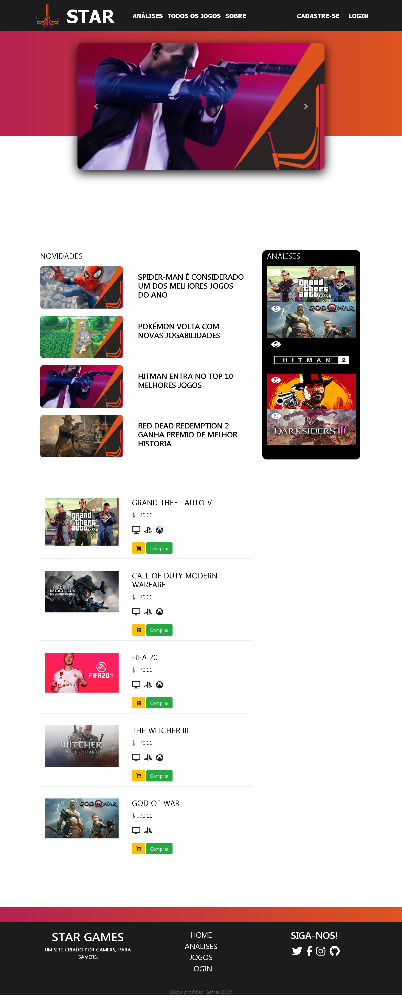

# ProjetoStar-Senac2018
Projeto feito no CURSO SENAC em 2018.
- FEITO PARA FINS DE ESTUDO.

##  SOBRE O PROJETO

- O objetivo do projeto era criar um website de qualquer area e implementar as habilidades aprendidas.

## STAR GAMES

#REQUISITOS

- PAGINA DE LOGIN E CADASTRO
- BANCO DE DADOS

# RECURSOS

 - HTML, CSS, PHP & SQL.
 - PNG,JPG & SVG IMAGES.

# Start Dev Environment for VSCode
 - Open project folder in VSCode
 - Install Live Server and Live Sass Compiler extension
 - Right click index.html > Open with Live Server